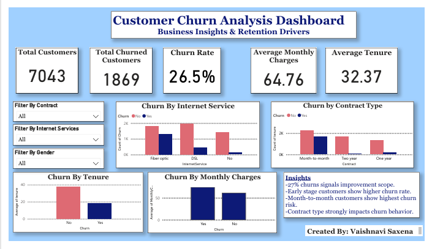

# Customer-Retention-&-Churn-Analytics
Comprehensive customer retention and churn analytics project combining Python-based data cleaning with interactive Power BI dashboards to uncover key risk drivers and actionable insights.

---

##  Project Overview

This project performs an end-to-end analysis of telecom customer churn to identify key retention drivers and high-risk customer segments.

The workflow includes:

1. **Data exploration & preprocessing using Python (Jupyter Notebook in VS Code)**
2. **Interactive dashboard development in Power BI**
3. **Business insight generation for retention strategy**

---

##  Dataset Summary

- **Total Customers:** 7,043  
- **Total Churned Customers:** 1,869  
- **Churn Rate:** 26.5%  
- **Key Features:**
  - Contract Type
  - Internet Service
  - Monthly Charges
  - Tenure
  - Gender
  - Churn Status

---

##  Data Exploration & Preprocessing (Python)

Data analysis was conducted using Python in a Jupyter Notebook environment.

### Key Steps Performed:

- **Data inspection** using `.info()` and `.describe()`
- **Checked missing values**
- **Validated churn distribution**
- **Explored feature-level relationships**
- **Prepared structured dataset for Power BI visualization**

Notebook file: `churn_analysis.ipynb`

---

##  Dashboard Development (Power BI)

An interactive Power BI dashboard was built to analyze churn patterns and retention drivers.

### Dashboard Highlights:

- KPI Cards for:
  - Total Customers
  - Total Churned Customers
  - Churn Rate
  - Average Monthly Charges
  - Average Tenure
- Slicers for dynamic filtering
- Contract-wise churn visualization
- Tenure and pricing impact analysis

---

##  Key Insights

- **Month-to-month contract customers** show the highest churn rate.
- **Early tenure customers** are more likely to churn.
- **Higher monthly charges** are associated with increased churn probability.
- **Contract type** significantly impacts retention behavior.

---

##  Business Recommendations

- Encourage long-term contracts through loyalty incentives.
- Strengthen onboarding experience for new customers.
- Implement targeted retention strategies for high-risk segments.
- Monitor pricing sensitivity among churn-prone customers.

---

##  Tools & Technologies Used

- **Python** (Data Exploration & Preprocessing)
- **Jupyter Notebook (VS Code)**
- **Power BI**
- **DAX**
- **Data Analysis & Visualization**

---

##  Author

**Vaishnavi Saxena**

